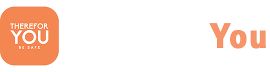
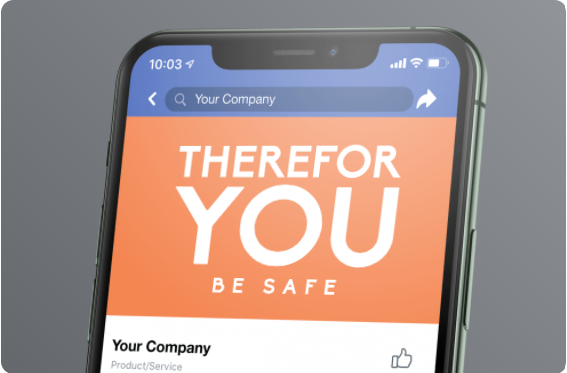
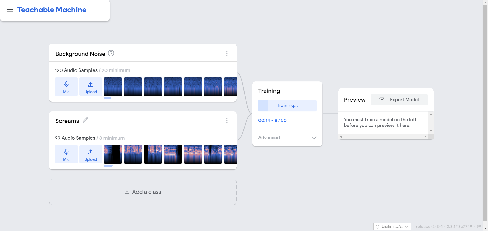

### Overview

This app performs recognition of (Antropogenic Disaster) speech Commands on mobile, reacting to the spoken word.

Guided from : https://github.com/tensorflow/examples/tree/master/lite/examples/speech_commands/android

Try our Interface for future : https://www.figma.com/proto/R7fP5qylP8myunm7Yin9vc/hackathon-test?node-id=1%3A734&scaling=min-zoom

## Inspiration
The pandemic has changed the way we live. Public places, streets , restaurants etc have encountered les and less crowd over the past year. We are more isolated in the public places than we ever were before. Now imagine walking home at night all by yourself, with no one around. What happens if you encounter danger? What happens if you are not in a position to reach out for your phone ? What happens if you don't have enough time to use your phone before something bad happens?. Our app therefor YOU comes in handy in all these places.
We found this research paper to be very helpful while ideating the project:
https://www.researchgate.net/publication/316709356_Audio_Data_Mining_for_Anthropogenic_Disaster_Identification_An_Automatic_Taxonomy_Approach

## What it does
So before going out alone in the places , where you don't feel safe or are not comfortable, you can turn on our app and keep the phone nearby you. It will start recognizing audio that comes around you . Our app is built in a way ,where if it encounters a panic sound , help call, scream it automatically recognizes it and sends a text to your selected contact and calls the nearby police station for help, without needing you to touch the phone or take it out.

## How we built it
The project starts with the base of machine learning model that predicts Anthropogenic Disaster Audio Identification. With the help of Google's latest technologies like Google cloud and Teachable Machine , we were able to create a Tensor Flow model from various audio data sets ,which we then used in our application while developing it using Java on android studio. We collected various audio data sets from internet which we used to create a model which has better accuracy. 
With more and more users joining our application , their personal audio with their permission will be analyzed and used to make  our model more accurate.

## What's next for Therefor You
We aim to integrate more features that would make this app a lot more effective, and easy to use.

